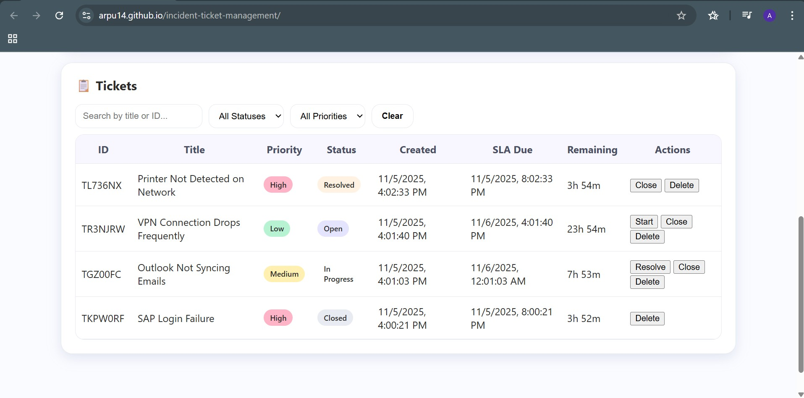

# 🛠️ Incident Ticket Management System

A simple **ITSM (IT Service Management)** style Incident Ticketing System to simulate how **L1–L2 Support** teams log, track, prioritize, assign, and resolve incidents while meeting **SLA deadlines**.

This project reflects **real-world support operations** used in Service Desk / Application Support / IT Operations environments.

---

## 🚀 Features

- Create and manage incident tickets
- Assign **priority**: Low, Medium, High
- Automatic **SLA countdown timers** based on priority
- Track ticket lifecycle:
  - **Open → In Progress → Resolved → Closed**
- Search & Filter tickets
- Auto-generated unique ticket IDs
- Clean, organized dashboard view

---

## 🧠 Realistic Ticket Examples

| Title | Priority | Description |
|------|---------|-------------|
| Printer Not Detected on Network | High | User unable to print, device not showing on network |
| VPN Connection Drops Frequently | Low | Remote work interrupted due to unstable VPN |
| Outlook Not Syncing Emails | Medium | Inbox not updating due to sync/server issue |
| SAP Login Failure | High | User unable to authenticate in SAP |

---

## 🧠 What I Learned

- How **Incident & SLA Management** works in IT support
- Difference between **L1 vs L2 escalation workflows**
- Importance of **clear documentation & ticket notes**
- Prioritizing issues based on **business impact**
- Tracking **SLA deadlines** to avoid escalations

---

## 💻 Tech Stack

| Component | Technology |
|----------|------------|
| Frontend UI | HTML, CSS |
| Logic / SLA Timers | JavaScript |
| Deployment | GitHub Pages |

---

## 🌐 Live Demo

🔗 **https://arpu14.github.io/incident-ticket-management/**

---

## 📸 Screenshots (UI Preview)

| New Ticket Form | Ticket Dashboard | SLA Timer View |
|---|---|---|
|  |  |  |

---

## 📦 How to Run Locally
```bash
git clone https://github.com/arpu14/incident-ticket-management.git
cd incident-ticket-management
open index.html
